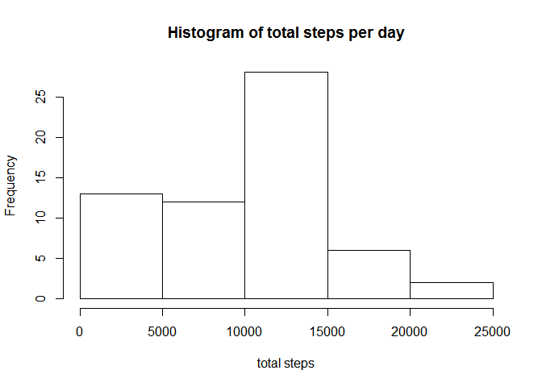
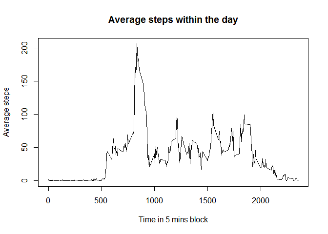
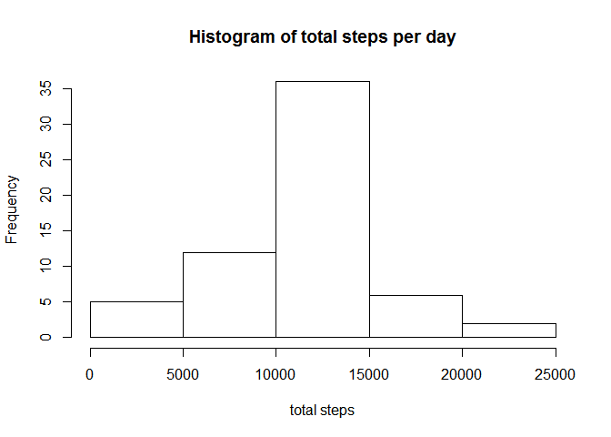
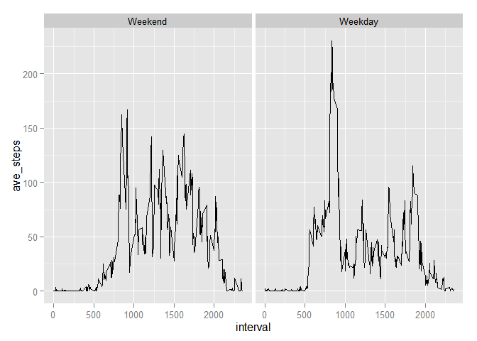

# Reproducible Research: Peer Assessment 1

# Reproducible Research: Peer Assessment 1

This assignment reads in a data set and then performs some simple analysis
and is documented in a R Markdown file.

## Loading and preprocessing the data

We first set the working directory, use read.csv() function to load the data, 
and transform the dates into R Date format.

```r
Act_data <- read.csv("activity.csv")
Act_data$date <- as.Date(Act_data$date)
```

## What is mean total number of steps taken per day?


```r
Act_data_aggr1 <- aggregate(Act_data$steps, by = list(Act_data$date), sum, na.rm = TRUE )
names(Act_data_aggr1) <- c("date", "total_steps")
hist(Act_data_aggr1$total_steps, main = "Histogram of total steps per day", xlab = "total steps")
```

 

A histogram is plotted.


```r
options(scipen = 999)
Xbar <- round(mean(Act_data_aggr1$total_steps),2)
M <- round(median(Act_data_aggr1$total_steps),2)
```

The **mean** total steps per day is *9354.23*.The **median** total steps per day is *10395*.


## What is the average daily activity pattern?


```r
Act_data_aggr2 <- aggregate(Act_data$steps, by = list(Act_data$interval), mean, na.rm = TRUE )
names(Act_data_aggr2) <- c("interval", "ave_steps")
plot(Act_data_aggr2$interval, Act_data_aggr2$ave_steps, main = "Average steps within the day", xlab = "Time in 5 mins block", ylab = "Average steps", type = "l")
```

 

## Imputing missing values


```r
mis_vec <- is.na(Act_data$steps)
mis <- sum(mis_vec)
```

The number of missing data (NA) is 2304.    

We use mean substitution (mean of all 5 min intervals) to replace missing values.We first split the data frame (by subsetting) into missing data (steps = NA) and non-missing data. Then we merge the mising data frame with the averaged data from the plot above & clean up the data. Finally we combined (rbind) the data to ge the completed data. 


```r
Act_data_mis <- Act_data[mis_vec,]
Act_data_nonmis <- Act_data[!mis_vec,]
Act_data_rep <- merge(Act_data_mis, Act_data_aggr2, by = "interval")
Act_data_rep <- Act_data_rep[,c("interval","date","ave_steps")]
names(Act_data_rep) <- c("interval","date","steps")
Act_data_with_replace <- rbind(Act_data_rep, Act_data_nonmis)
```

Repeat the procedure above but with new data set


```r
Act_data_aggr3 <- aggregate(Act_data_with_replace$steps, by = list(Act_data_with_replace$date), sum, na.rm = TRUE )
names(Act_data_aggr3) <- c("date", "total_steps")
hist(Act_data_aggr3$total_steps, main = "Histogram of total steps per day", xlab = "total steps")
```

 

Calcuate mean and median with new data


```r
Xbar2 <- round(mean(Act_data_aggr3$total_steps),2)
M2 <- round(median(Act_data_aggr3$total_steps),2)
```

The **new mean** total steps per day is *10766.19*.The **new median** total steps per day is *10766.19*.    
The distribution appears more symmetric because we have replaced missing data with the average values.

## Are there differences in activity patterns between weekdays and weekends?

Determine first what Day is the particular date, and then determine whether it is a Saturday or Sunday.  
then relabel the variable values.


```r
Day_of_week <- weekdays(Act_data_with_replace$date)
Act_data_with_replace2 <- cbind(Act_data_with_replace,Day_of_week)
Weekday <- as.factor(!(Act_data_with_replace2$Day_of_week %in% c("Saturday", "Sunday")))
Act_data_with_replace3 <- cbind(Act_data_with_replace2, Weekday)
Act_data_with_replace3 <-within(Act_data_with_replace3, levels(Weekday)[levels(Weekday) == TRUE] <- "Weekday")
Act_data_with_replace3 <-within(Act_data_with_replace3, levels(Weekday)[levels(Weekday) == FALSE] <- "Weekend")
```

Plot the results.


```r
library("ggplot2")
Act_data_aggr4 <- aggregate(Act_data_with_replace3$steps, by = list(Act_data_with_replace3$interval, Act_data_with_replace3$Weekday), mean, na.rm = TRUE )
names(Act_data_aggr4) <- c("interval", "Weekday", "ave_steps")
ggplot(Act_data_aggr4, aes(x = interval, y = ave_steps, group = Weekday)) + geom_line() + facet_wrap( ~ Weekday)
```

 

Plotting the results, it looks as if there is a higher activity on weekday mornings compared to weekend mornings.
